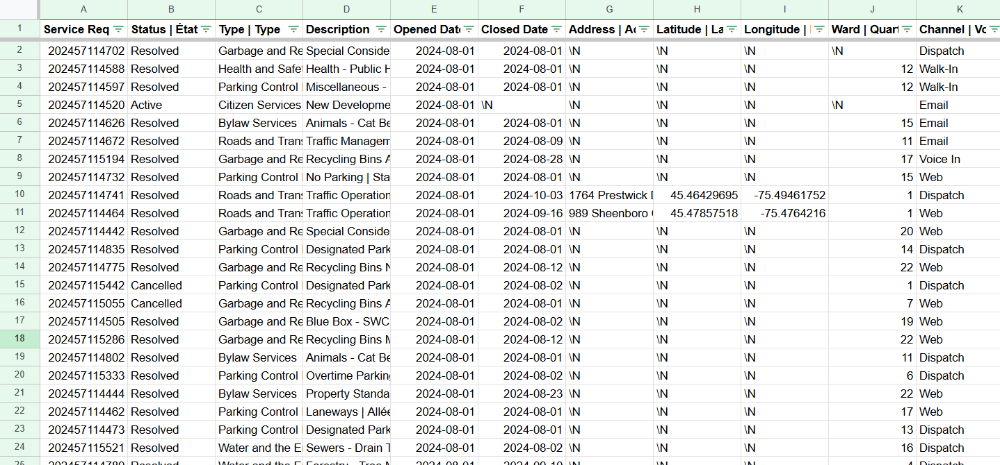
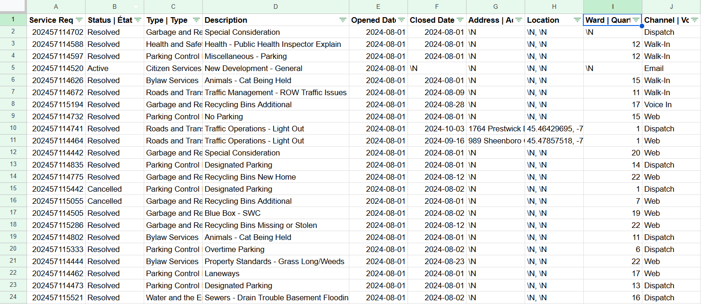
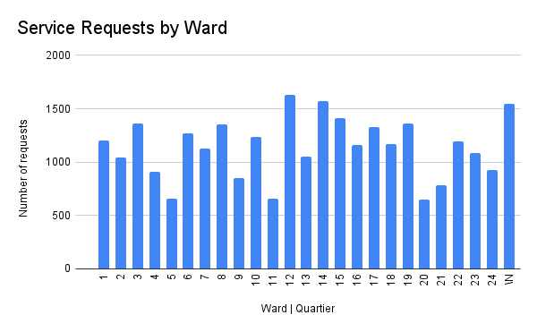
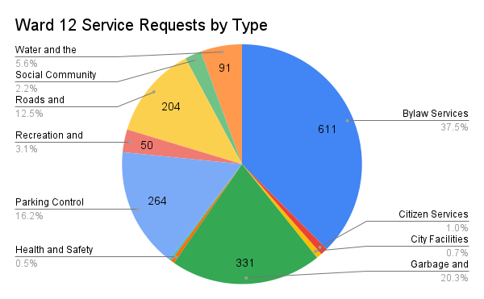

**November 6th, 2024** 
**MPAD 2003** 
**Mark Talbot** 
**Presented to Jean-Sébastien Marier** 

# Exploring Service Requests By Ward

## 1. Introduction

In this assignment, I will be analyzing a subset of a dataset of service requests in Ottawa from August of 2024. The subset was provided to me by my instructor as a CSV file. The city of Ottawa is the source and they receive service requests from many different channels such as, online, walk-ins, and calls, and the data is then published on the open Ottawa website. The dataset was last updated on October 3rd, 2024, and won't be updated again as of November 5th, 2024.

* [Original dataset](https://open.ottawa.ca/documents/65fe42e2502d442b8a774fd3d954cac5/about)
* [Subset](https://raw.githubusercontent.com/jsmarier/course-datasets/refs/heads/main/ottawa-311-service-requests-august-2024.csv)

The main sections covered in this assignment will include getting data, understanding data, and finding a potential story.

The main sections covered in this assignment will include getting data, understanding data through VIMO analysis, cleaning data and analyzing it, as well as finding a potential story.

## 2. Getting Data

### importing the data into Google Sheets
My first step in importing the data into Google Sheets was to open the dataset. Once it was open I right-clicked on “save as”, and saved it to the folder I created for this project as a CSV file. Next, I had to upload the CSV file to my Google Drive. In my drive, at the top left corner, I clicked new, then file upload. I selected the CSV file from my folder and it uploaded to my drive. Lastly, I opened a new Google sheet and selected file, import, then chose the file I just uploaded and then hit insert. Under import location I selected “create new spreadsheet” and under separator type, I chose Comma as the delimiter in this file is a comma. I clicked on import data and once it finished creating the spreadsheet I clicked the link that said “open now”.

#### Screenshot of the data in google sheets.
 
*Figure 1: The first 24 rows of the dataset in google sheets*

### The link to the google sheet dataset is
[Google Sheet](https://docs.google.com/spreadsheets/d/1dqF2A1oiw0w1ehWgON6WXc14ytvHVBTgU7UsbzIy1aA/edit?gid=91507516#gid=91507516 )
 

There are 11 different data types in the set each with their own column, as well as 28,538 recorded service requests. The data is not very clean as many columns such as address, longitude, and attitude, have missing values, and some cells are not aligned with other cells in the same column.  
* Column K uses nominal variables with the different ways services were requested. 
* Column B also uses nominal variables to signify the status of the request. 
* In columns E and F interval variables are used to represent the date that the request was opened and closed. Some data points in the closed column are missing. 

### Sugested improvments
For people to better understand the wards and their location it would be helpful to add the name of the ward inside the column alongside the number, as well as to add another column with the councilor’s name. This will give readers a clearer context to the location of these requests as opposed to trying to figure out ward numbers and coordinates which many people dont know.

### Question
How does the volume of service requests vary from ward to ward?

## 3. Understanding Data

### 3.1 VIMO Analysis
Cleaning data is very important, and making sure you check the dataset for missing or invalid values is as well. In the Data Journey reading it mentions that you must “document what you found and what you did to clean the data” (Data Journey, 2021, Step 2: Explore, clean, describe section). It is crucial to maintain the integrity of the set and document what is changed. So I will analyze the data using VIMO (Valid, Invalid, Missing, Outlier).
* **Valid**
 Column B: All data in this column was valid, it was accurate, complete, and consistent with expected values. Each of the rows had one of three options of the status being active, resolved or cancelled.
* **Invalid**
Column E: This column contained Invalid data as the last request in the dataset was made on September 1st. This is after the August time frame so it is inconsistent with the rest of the data.
* **Missing**
Columns G, H, I: Missing Data is frequent in these three columns, they all relate to the location of the request so it is apparent that finding the location of the request was difficult. in Column I there are 1,549 missing data points but that is nothing compared to the 24,128 missing coordinates in columns G and H.
* **Outlier**
Column K: This column shows the channel of how the request was received. The outliers for this were the requests by counter as only 2 requests were by this channel.

### 3.2 Cleaning data
#### Split Function

1. I decided I wanted to `split` the description to get rid of the french version.
2. I right-clicked on the description column and hit “add column left” to add two new columns.
3. In the first column I wrote the function `[=SPLIT(D2,"|")]`. The "|" sets the separator to thst character.
4. In the bottom right corner of the cell I put the function in, there is a circle. I dragged the circle down to the end of the datasheet to replica the split function for the rest of the column.
5. I then copied and pasted values only. 
6. Lastly, I deleted the old description with both languages and the new column with just French.

#### Whitespace Function
To clear the white space from each cell in the dataset i followed these steps.
1. I selected the entire dataset by clicking on the block to the left of column A and on top of column 1
2. I then went to the data tab at the top of the screen and clicked on data cleanup.
3. From there 3 options showed up, I clicked “trim whitespace”

#### Concatenate function

I wanted to merge the latitude and longitude to make one column called coordinates. The steps to do so are as follows.
1. I right-clicked on the column with latitude and selected add column left
2.  I then typed my title for the column which was “Coordinates”
3. I then implemented the Concatenate tool into row 1 of the new column and wrote the following function `=CONCATENATE(I2,", ",J2)`
4. A suggestion box popped up for the rest of the column to replicate the function so I accepted however, if that doesn’t show up you must do the same thing as the `split` function. You drag down from the corner of the cell until you reach the end of the column.
5. I copied the new column and went to the edit tab, then clicked paste special, and values only
6. Lastly, I deleted the two original columns of latitude and longitude.

#### Screenshot of cleaned data set
 
*Figure 2: This is the dataset after I used the three cleaning techniques*

Support your claims by citing relevant sources. Please follow .

**For example:**

As Cairo (2016) argues, a data visualization should be truthful...

### 3.3. Exploratory Data Analysis (EDA)
 
*Figure 2: This pivot table shows the realtionship between the ward number and the toal number of service requests*

 
*Figure 3: This column chart shows the total number of service requests by ward*

I chose these variables because I feel they offer a great way to analyze the data. By sorting the number of requests by ward it allows us to see which wards have a high volume of service requests and which have lower volume. If this data were to be replicated for future months, it would be a good indicator of trends within the wards to see if there have been less or more service requests made in the last month.

An interesting statistic that stands out is that ward 12, Rideau-Vanier, has the most service requests in the Ottawa area. This ward had a total of 1,628 requests which is 57 more requests than ward 14, in second place.

This graph can provide us with a story that some wards need to have their resource allocation adjusted based on how many requests they receive. For wards with many requests, they could receive more personnel and equipment to better suit their community. The same applies to wards with low requests, they could have some of their resources distributed to other wards.

An easy number that would warrant further investigation is 1,549 requests that aren't assigned to a ward. Depending on where these requests came from it could massively skew the data and change the narrative.

I decided to look into this even further and created two pie charts, one for ward 12, and one for ward 20. The highest and lowest volume of requests per ward. Based on these two pie charts you can see some similarities and differences. Both pie charts have “garbage and recycling” and “Bylaw services” in the top three most frequent requests, indicating that those are two major issues in the city. A difference is that ward 12 is Rideau-Vanier which is in the city, while ward 20 is the Osgoode ward, which is in the country. And while both graphs had a high percentage of Bylaw services, ward 12 had 601 compared to ward 20 with 100. This makes sense as there aren't as many by law officers in that part of the city.

 
*Figure 4: This pie chart shows the distribution of service requests in ward 12*

.png) 
*Figure 3: This pie chart shows the distribution of service requests in ward 20*

## 4. Potential Story
My potential story is that resources need to be reallocated between the wards based on the number and type of requests. A lot more information is needed to create a compelling story, as the base data just isn’t enough to get all the facts straight. To successfully tell this story, I would need the population sizes for each ward to help see if certain wards have fewer requests because they have less people or if it's more efficiently run. To deepen the story, data from previous months would be helpful to analyze trends and predict future issues. 
It would also be helpful to get Insight from the people who live in these wards and their Councillors. Being able to interview the people and get their insight as to what is functional and what isn’t could greatly help solve the issues. Interviewing the ward Councilors would also help as I could ask them what problems they are aware of, what they plan to do to fix them, and what factors are considered when allocating resources.

### Relevant sources 

[Article 1](https://ruor.uottawa.ca/items/b5ac1fc5-7185-4556-a59c-3b6af4051085)

This article focuses on urban inequality in Ottawa and explores the idea of gentrification.This relates to my story because these up-and-coming neighborhoods will require new services and resources will need to be spread out.

[Article 2](https://www.kdevelopedia.org/Development-Overview/all/resource-reallocation--23.do)

This Article Highlights is relevant to my story because it highlights the importance of reallocation of resources.

## 5. Conclusion

The most challenging aspect of this assignment was dealing with such a large dataset and I felt overwhelmed when seeing how many rows of data there were. Another challenging aspect was getting used to using Github and VScode again as it has been almost a year since I last used it. There were a few rewarding parts, firstly I felt a sense of accomplishment when creating the charts and pivot tables as I sifted through the data and found something worth visualizing. Secondly, the finished product is rewarding, seeing how all my hard work created an in-depth analysis of the data. 

The biggest gap in my knowledge is probably putting the functions in Google Sheets into practice. I feel I can remember what each function does but when it is time to actually perform the task I have to refer back to lecture videos. 
Something I could have done differently would be to start the assignment earlier, I fell behind in other classes leaving me with less time to complete the assignment than I would have liked. Adding on to that point, if I had more time I could have planned my assignment better before starting. I found myself just jumping into the questions rather than taking my time to plan it out beforehand.

## 6. References

Statistique Canada. (2021, September 2). Bar chart (5.2). Statistics Canada. Retrieved November 6, 2024, from https://www150.statcan.gc.ca/n1/edu/power-pouvoir/ch9/bargraph-diagrammeabarres/5214818-eng.htm

Ilic, L. (2023, June 21). Urban divisions: Gentrification and income polarization in Ottawa, Canada. University of Ottawa. Retrieved November 5, 2024, from https://ruor.uottawa.ca/items/b5ac1fc5-7185-4556-a59c-3b6af4051085

City of Ottawa. (n.d.). Mayor and City Councillors. Retrieved November 6, 2024, from https://ottawa.ca/en/city-hall/mayor-and-city-councillors

K-Developedia. (n.d.). Resource reallocation. Retrieved November 6, 2024, from https://www.kdevelopedia.org/Development-Overview/all/resource-reallocation--23.do

City of Ottawa. (2024, October 3). 2024 service requests. Retrieved November 4, 2024, from https://open.ottawa.ca/documents/65fe42e2502d442b8a774fd3d954cac5/about

Marier, J.-S. (2021, October 9). Cleaning data in Google Sheets [Video]. YouTube. Retrieved November 3, 2024, from https://www.youtube.com/watch?v=U4yigiawIEU&embeds_referring_euri=https%3A%2F%2Fbrightspace.carleton.ca%2F&source_ve_path=MjM4NTE